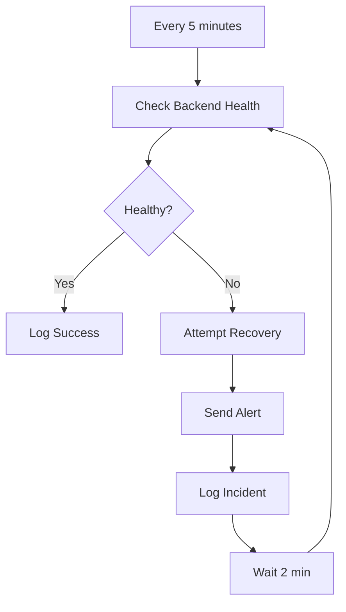

# 🤖 Korean AI Compliance - Self-Managing Workflow System

## 🎯 Vision: Platform that Takes Care of Itself

Transform your platform into a self-managing system with automated workflows for:
- Health monitoring & recovery
- Payment processing & subscription management
- User onboarding & engagement
- Compliance reporting
- Performance optimization
- Error handling & alerting

---

## 📋 Workflow Architecture Overview

### Strategy: Hybrid Approach

We'll use multiple tools to create a robust, self-managing system:

1. **Vercel Workflow DevKit** - For complex, multi-step user workflows
2. **Render Cron Jobs** - For scheduled maintenance & monitoring
3. **Stripe Webhooks** - For payment event automation (already implemented!)
4. **GitHub Actions** - For CI/CD and deployment automation
5. **Supabase Functions** - For database-triggered workflows (future)

---

## 🔄 Core Workflows to Implement

### 1. Health Monitoring & Self-Healing Workflow

**Purpose**: Automatically detect and recover from issues

**Workflow:**


**Implementation Options:**

**Option A: Render Cron Job (Recommended for now)**
```python
# backend/jobs/health_monitor.py
import os
import requests
import logging
from datetime import datetime

async def health_monitor_workflow():
    """Run every 5 minutes via Render Cron"""

    # Check backend health
    backend_health = await check_backend()

    # Check frontend health
    frontend_health = await check_frontend()

    # Check database health
    db_health = await check_database()

    # Check Stripe connection
    stripe_health = await check_stripe()

    # If any fail, attempt recovery
    if not all([backend_health, frontend_health, db_health, stripe_health]):
        await attempt_recovery()
        await send_alert_email()

    # Log to monitoring service
    await log_health_metrics({
        'backend': backend_health,
        'frontend': frontend_health,
        'database': db_health,
        'stripe': stripe_health,
        'timestamp': datetime.utcnow()
    })
```

**Option B: Vercel Workflow (More sophisticated)**
```typescript
// workflows/health-monitoring.ts
"use workflow";

import { sleep } from "workflow";

export async function healthMonitoringWorkflow() {
  while (true) {
    await checkSystemHealth();
    await sleep("5m"); // Check every 5 minutes
  }
}

async function checkSystemHealth() {
  "use step";

  const results = await Promise.all([
    checkBackend(),
    checkFrontend(),
    checkDatabase(),
    checkStripe()
  ]);

  if (results.some(r => !r.healthy)) {
    await attemptRecovery();
    await sendAlert();
  }
}
```

---

### 2. Payment & Subscription Management Workflow

**Purpose**: Automate payment processing and subscription lifecycle

**Already Implemented:** ✅ Webhook handler in `backend/app/main.py`

**Enhancements Needed:**

```typescript
// workflows/subscription-management.ts
"use workflow";

import { sleep } from "workflow";

export async function subscriptionLifecycleWorkflow(customerId: string) {
  // Day 0: Welcome sequence
  await sendWelcomeEmail(customerId);
  await grantPlatformAccess(customerId);

  // Day 1: Onboarding
  await sleep("1d");
  await sendOnboardingGuide(customerId);

  // Day 3: Check usage
  await sleep("2d");
  await checkUsageAndSendTips(customerId);

  // Day 7: Follow up
  await sleep("4d");
  await sendWeeklyReport(customerId);

  // Day 25: Renewal reminder (5 days before renewal)
  await sleep("18d");
  await sendRenewalReminder(customerId);

  // Day 30: Renewal
  await sleep("5d");
  const renewed = await checkRenewalStatus(customerId);

  if (!renewed) {
    await sendRetentionOffer(customerId);
  }
}

async function handleFailedPaymentWorkflow(customerId: string) {
  "use workflow";

  // Immediate: Alert customer
  await sendPaymentFailedEmail(customerId);

  // Day 1: First retry
  await sleep("1d");
  await retryPayment(customerId);

  // Day 3: Second retry
  await sleep("2d");
  const success = await retryPayment(customerId);

  if (!success) {
    // Day 7: Final notice
    await sleep("4d");
    await sendFinalNotice(customerId);

    // Day 10: Suspend account
    await sleep("3d");
    await suspendAccount(customerId);
  }
}
```

---

### 3. User Onboarding Workflow

**Purpose**: Guide new users through setup automatically

```typescript
// workflows/user-onboarding.ts
"use workflow";

import { sleep } from "workflow";

export async function userOnboardingWorkflow(userId: string, email: string) {
  // Step 1: Welcome email (immediate)
  await sendWelcomeEmail(userId, email);

  // Step 2: First risk assessment prompt (2 hours)
  await sleep("2h");
  const completedAssessment = await checkRiskAssessmentCompleted(userId);

  if (!completedAssessment) {
    await sendRiskAssessmentReminder(userId);
  }

  // Step 3: Feature tour (1 day)
  await sleep("1d");
  await sendFeatureTourEmail(userId);

  // Step 4: Compliance guide (3 days)
  await sleep("2d");
  await sendComplianceGuide(userId);

  // Step 5: Ask for feedback (7 days)
  await sleep("4d");
  await requestFeedback(userId);

  // Step 6: Upgrade prompt (14 days)
  await sleep("7d");
  await sendUpgradeOffer(userId);
}

async function sendWelcomeEmail(userId: string, email: string) {
  "use step";

  // Send via Resend API
  await fetch(`${process.env.NEXT_PUBLIC_API_URL}/api/emails/welcome`, {
    method: 'POST',
    body: JSON.stringify({ userId, email })
  });
}
```

---

### 4. Compliance Reporting Workflow

**Purpose**: Automatically generate and send compliance reports

```typescript
// workflows/compliance-reporting.ts
"use workflow";

import { sleep } from "workflow";

export async function complianceReportingWorkflow(customerId: string) {
  while (true) {
    // Generate monthly report
    await generateMonthlyReport(customerId);

    // Wait until next month
    await sleep("30d");
  }
}

async function generateMonthlyReport(customerId: string) {
  "use step";

  // Gather compliance data
  const assessments = await fetchRiskAssessments(customerId);
  const activities = await fetchActivities(customerId);

  // Generate PDF report
  const report = await createComplianceReport({
    assessments,
    activities,
    period: 'monthly'
  });

  // Email report
  await emailReport(customerId, report);

  // Store in database
  await storeReport(customerId, report);
}
```

---

### 5. Performance Optimization Workflow

**Purpose**: Automatically optimize platform performance

```typescript
// workflows/performance-optimization.ts
"use workflow";

import { sleep } from "workflow";

export async function performanceOptimizationWorkflow() {
  while (true) {
    // Check every hour
    await optimizePerformance();
    await sleep("1h");
  }
}

async function optimizePerformance() {
  "use step";

  // Clear old cache
  await clearExpiredCache();

  // Optimize database queries
  await analyzeSlowQueries();

  // Check bundle sizes
  await checkBundleSizes();

  // Monitor response times
  const metrics = await getPerformanceMetrics();

  if (metrics.avgResponseTime > 500) {
    await sendPerformanceAlert();
  }
}
```

---

### 6. Error Monitoring & Recovery Workflow

**Purpose**: Catch and handle errors automatically

```typescript
// workflows/error-handling.ts
"use workflow";

export async function errorHandlingWorkflow(errorData: any) {
  // Log error
  await logError(errorData);

  // Attempt recovery based on error type
  if (errorData.type === 'database') {
    await attemptDatabaseRecovery();
  } else if (errorData.type === 'api') {
    await attemptAPIRecovery();
  } else if (errorData.type === 'payment') {
    await handlePaymentError(errorData);
  }

  // If critical, alert immediately
  if (errorData.severity === 'critical') {
    await sendImmediateAlert(errorData);
  }

  // Track in monitoring
  await trackErrorMetrics(errorData);
}
```

---

## 🛠️ Implementation Plan

### Phase 1: Foundation (Week 1-2)

1. **Install Vercel Workflow DevKit**
   ```bash
   cd frontend
   npm install workflow
   ```

2. **Configure Next.js for Workflows**
   ```typescript
   // next.config.js
   import { withWorkflow } from 'workflow/next';

   export default withWorkflow({
     // ... existing config
   });
   ```

3. **Create Workflow Directory Structure**
   ```
   frontend/
   ├── workflows/
   │   ├── health-monitoring.ts
   │   ├── subscription-management.ts
   │   ├── user-onboarding.ts
   │   ├── compliance-reporting.ts
   │   └── error-handling.ts
   ├── app/
   │   └── api/
   │       └── workflows/
   │           ├── health/route.ts
   │           ├── subscription/route.ts
   │           └── onboarding/route.ts
   ```

### Phase 2: Core Workflows (Week 3-4)

1. **Implement Health Monitoring**
   - Create health check workflow
   - Setup Render cron job or Vercel cron
   - Configure alerting

2. **Enhance Payment Workflows**
   - Build on existing webhook handler
   - Add retry logic
   - Implement dunning process

3. **Deploy User Onboarding**
   - Create email templates
   - Build onboarding sequence
   - Test with Resend API

### Phase 3: Advanced Features (Week 5-6)

1. **Compliance Reporting**
   - Automated report generation
   - PDF creation
   - Email delivery

2. **Performance Optimization**
   - Automated monitoring
   - Resource optimization
   - Alert thresholds

### Phase 4: Monitoring & Refinement (Ongoing)

1. **Setup Workflow Observability**
   ```bash
   npx workflow inspect runs --web
   ```

2. **Configure Alerts**
   - Email alerts via Resend
   - Slack/Discord webhooks
   - SMS for critical issues

3. **Optimize & Scale**
   - Monitor workflow performance
   - Adjust timings
   - Add new workflows as needed

---

## 🔧 Quick Start: First Workflow

Let's implement the **Health Monitoring Workflow** first:

### Step 1: Install Workflow DevKit

```bash
cd ~/korean-AI-compliance-/frontend
npm install workflow
```

### Step 2: Update next.config.js

```typescript
// frontend/next.config.js
import { withWorkflow } from 'workflow/next';

const nextConfig = {
  // ... existing config
};

export default withWorkflow(nextConfig);
```

### Step 3: Create First Workflow

```typescript
// frontend/workflows/health-check.ts
"use workflow";

import { sleep } from "workflow";

export async function healthCheckWorkflow() {
  while (true) {
    await performHealthCheck();
    await sleep("5m"); // Check every 5 minutes
  }
}

async function performHealthCheck() {
  "use step";

  try {
    // Check backend
    const backendResponse = await fetch('https://korean-ai-compliance.onrender.com/healthz');
    const backendHealthy = backendResponse.ok;

    // Check frontend
    const frontendResponse = await fetch('https://korean-ai-compliance.vercel.app');
    const frontendHealthy = frontendResponse.ok;

    console.log({
      timestamp: new Date().toISOString(),
      backend: backendHealthy ? '✅' : '❌',
      frontend: frontendHealthy ? '✅' : '❌'
    });

    // If unhealthy, send alert
    if (!backendHealthy || !frontendHealthy) {
      await sendHealthAlert({ backend: backendHealthy, frontend: frontendHealthy });
    }
  } catch (error) {
    console.error('Health check failed:', error);
    await sendHealthAlert({ error: error.message });
  }
}

async function sendHealthAlert(data: any) {
  "use step";

  // Send email via Resend
  console.log('🚨 HEALTH ALERT:', data);
  // TODO: Implement email sending
}
```

### Step 4: Create API Route to Trigger

```typescript
// frontend/app/api/workflows/health/route.ts
import { start } from 'workflow/api';
import { healthCheckWorkflow } from '@/workflows/health-check';
import { NextResponse } from 'next/server';

export async function POST() {
  await start(healthCheckWorkflow, []);

  return NextResponse.json({
    message: 'Health monitoring workflow started'
  });
}
```

### Step 5: Start the Workflow

```bash
# Manually trigger
curl -X POST http://localhost:3000/api/workflows/health

# Or setup Vercel Cron to trigger automatically
```

---

## 📊 Workflow Monitoring Dashboard

Use the Workflow DevKit UI to monitor all workflows:

```bash
cd frontend
npx workflow inspect runs --web
```

This gives you:
- ✅ Real-time workflow status
- ✅ Step execution details
- ✅ Error tracking
- ✅ Performance metrics
- ✅ Retry history

---

## 🎯 Benefits of Self-Managing Platform

### Automated Operations
- ✅ No manual health checks needed
- ✅ Automatic error recovery
- ✅ Self-optimizing performance

### Improved Reliability
- ✅ 24/7 monitoring
- ✅ Instant issue detection
- ✅ Automated recovery attempts

### Better User Experience
- ✅ Proactive issue resolution
- ✅ Automated onboarding
- ✅ Timely notifications

### Reduced Operational Cost
- ✅ Less manual intervention
- ✅ Fewer support tickets
- ✅ Automated reporting

### Scalability
- ✅ Handle more users automatically
- ✅ Self-adjusting resources
- ✅ Automated compliance

---

## 🔗 Integration with Existing Systems

### With Stripe (Already Done!)
Your webhook handler at `/webhook/stripe` is already a workflow! We just need to enhance it with:
- Retry logic
- Email notifications
- Database updates

### With Render
Add cron jobs for:
- Database backups
- Log rotation
- Cache clearing

### With Vercel
Use Vercel Cron to trigger workflows:
```javascript
// vercel.json
{
  "crons": [{
    "path": "/api/workflows/health",
    "schedule": "*/5 * * * *"
  }]
}
```

---

## 🤖 Auto PR Triage Workflow (IMPLEMENTED)

**Status**: ✅ Active and Running

**Purpose**: Automatically manage PR lifecycle, close outdated PRs, rebase medium-priority PRs, and ensure code quality.

**Location**: `.github/workflows/auto-pr-triage.yml`

**Triggers:**
- Daily schedule at 9 AM UTC (6 PM KST)
- Manual dispatch via workflow_dispatch
- On PR events (opened, synchronize, reopened)

**Features:**
1. **Automatic PR Classification**
   - Analyzes PR titles to determine action (keep, close, rebase, review)
   - Configurable patterns for different PR types

2. **Automated Cleanup**
   - Closes outdated PRs with bilingual Korean/English messages
   - Provides clear reasoning and reopen instructions

3. **Smart Rebasing**
   - Automatically rebases medium-priority PRs
   - Keeps PRs aligned with base branches

4. **Quality Checks**
   - Runs lint and build on frontend code
   - Integrates CodeQL security analysis for high-priority PRs
   - Enforces Korean AI compliance standards

5. **Status Reporting**
   - Posts detailed status comments in formal Korean (존댓말) and English
   - Includes compliance markers (PIPC, Korean AI 기본법)
   - Provides rerun commands

**Compliance Features:**
- ✅ Formal Korean language (존댓말) in all messages
- ✅ Korean AI Basic Law compliance markers
- ✅ PIPC guidelines adherence
- ✅ Bilingual support (Korean/English)

**Benefits:**
- Reduces manual PR management overhead
- Ensures code quality before merge
- Maintains repository cleanliness
- Enforces compliance standards automatically
- Provides clear communication to contributors

---

## 📈 Next Steps

### Immediate (After Deployment Complete)
1. Install Workflow DevKit
2. Implement health monitoring
3. Test in development

### Short-term (1-2 weeks)
1. Deploy health monitoring to production
2. Add user onboarding workflow
3. Enhance payment workflows

### Long-term (1-2 months)
1. Add compliance reporting
2. Implement performance optimization
3. Build custom admin dashboard

---

## 💡 Pro Tips

1. **Start Simple**: Begin with one workflow (health monitoring)
2. **Monitor Everything**: Use the Workflow DevKit UI extensively
3. **Test Thoroughly**: Test workflows in development first
4. **Document Well**: Keep workflow documentation updated
5. **Alert Smartly**: Don't over-alert, focus on actionable items

---

## 🎉 Vision: Fully Autonomous Platform

**End Goal:**
- Platform monitors itself 24/7
- Automatically recovers from errors
- Self-optimizes performance
- Handles user lifecycle automatically
- Generates compliance reports automatically
- Scales resources as needed
- Alerts only when human intervention is required

**Your platform becomes a "set it and forget it" business!** 🚀

---

*Last updated: 2025-11-15*
*Status: Auto PR Triage implemented and active*
*Priority: Continue with health monitoring and user workflows*
